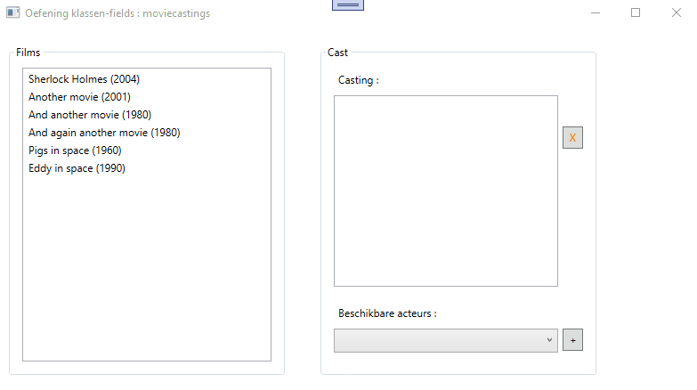

# Oefening Casting : klassen en velden

Bekijk onderstaand filmpje aandachtig zodat je weet wat er van je verwacht wordt.  
  
In deze oefening maak je 3 klassen aan :   
  * Actor
    * id : string  
    * lastname : string  
    * firstname : string  

    Je voorziet een constructor die zowel lastname als firstname ontvangt.  
    In de constructor zorg je er voor dat het veld id automatisch gevuld wordt met een unieke waarde.  
    Je kan hiervoor volgende instructie gebruiken :  id = Guid.NewGuid().ToString()  
    Je overschrijft de ToString methode en toont in de plaats de naam en de voornaam.  

  * Movie
    * id : string
    * name : string
    * year : int
    
    Je voorziet een constructor die zowel de name als year ontvangt.
    In de constructor zorg je er voor dat het veld id automatisch gevuld wordt met een unieke waarde.  
    Je kan hiervoor volgende instructie gebruiken :  id = Guid.NewGuid().ToString()  
    Je overschrijft de ToString methode en toont in de plaats de naam en het jaar.  
    
  * Cast
    * movie_id : string 
    * actor_id : string 
    
    Je voorziet een constructur die de waarde van beide velden kan invullen.
    
 
In je WPF venster zorg je voor 3 globales lists : eentje voor de acteurs, eentje voor de fims en eentje voor de casts (= acteurs in een film).    
Bij de opstart zorg je er voor dat je een aantal films en een aantal acteurs aanmaakt en deze toevoegt aan hun betrokken lists.  

Wanneer er geen film geselecteerd is, dan is zowel lstCasting als cmbActors leeg.  
Wanneer er een film geselecteerd is, dan is lstCasting gevuld met de acteurs die meespelen in de film, en cmbActors gevuld met de acteurs die niet deelnemen.  
Wanneer er op btnAddToCasting wordt geklikt, dan dient de geselecteerde acteur uit cmbActors toegevoegd te worden aan de list casts en dient lstCasting bijgewerkt te worden.  
Wanneer er op btnRemoveFromCasting wordt geklikt, dan dient het object (te identificeren a.d.h. van de geselecteerde film in ltsMovies en de geselecteerde acteur in lstCasting) terug uit de list castings verwijderd te worden en dient zowel lstCasting als cmbActors bijgewerkt te worden.    

  
  
